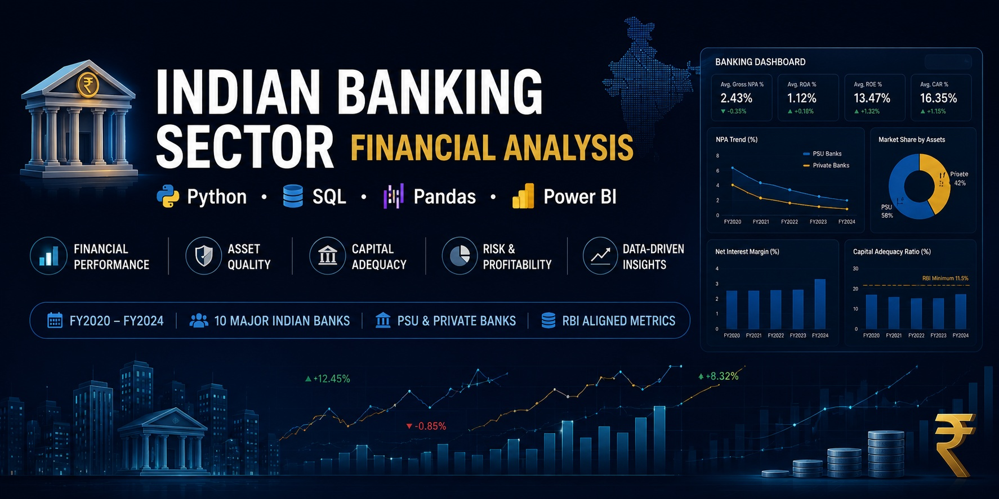
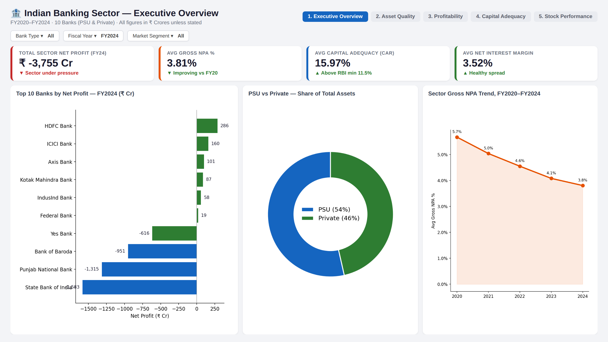
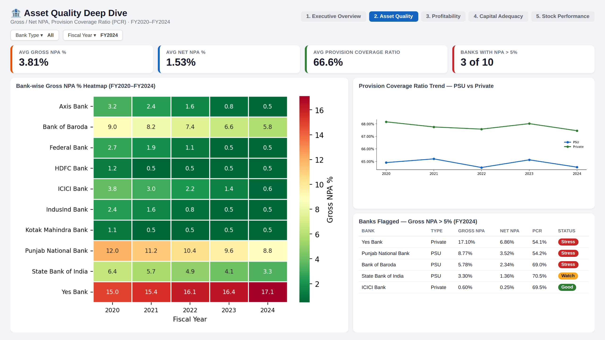
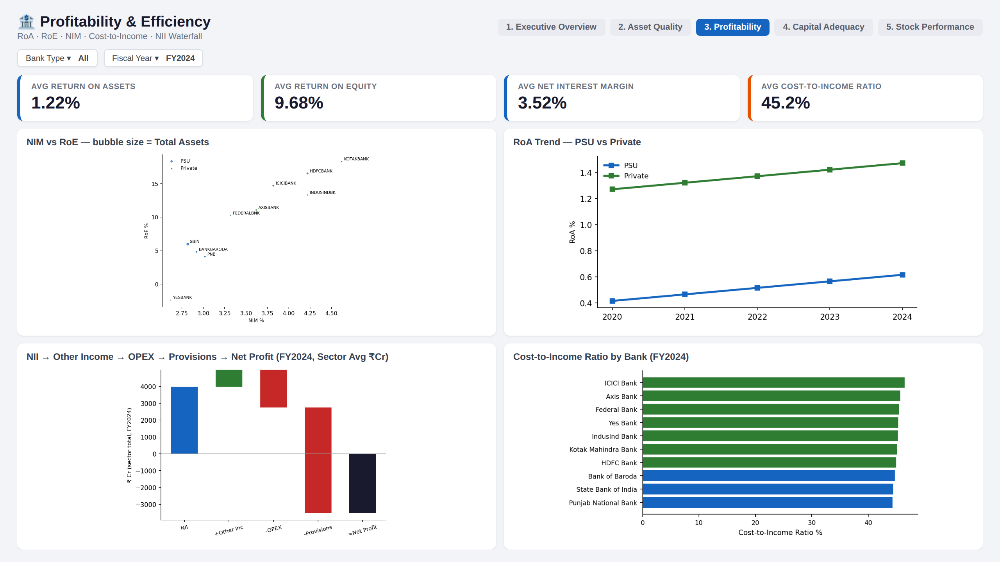
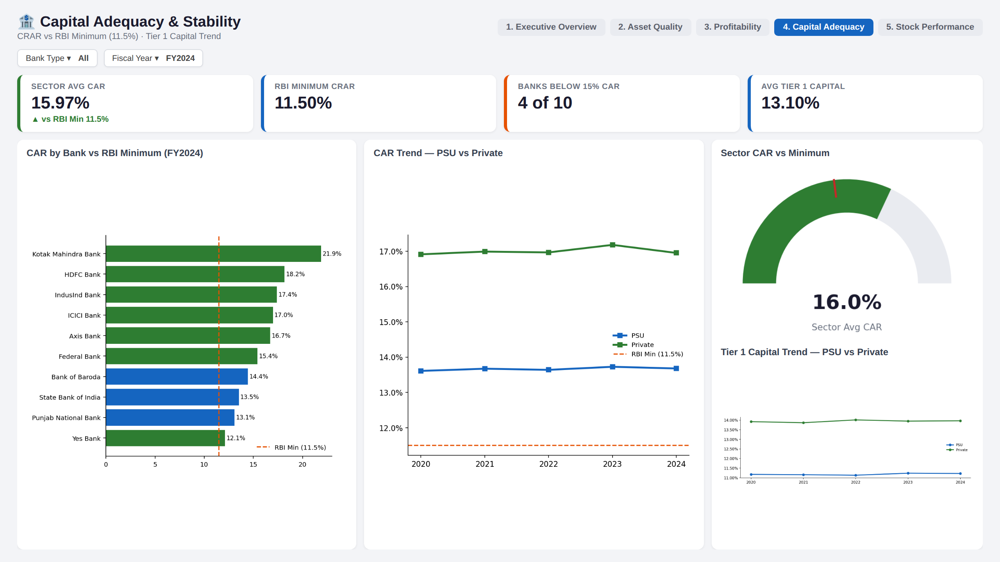
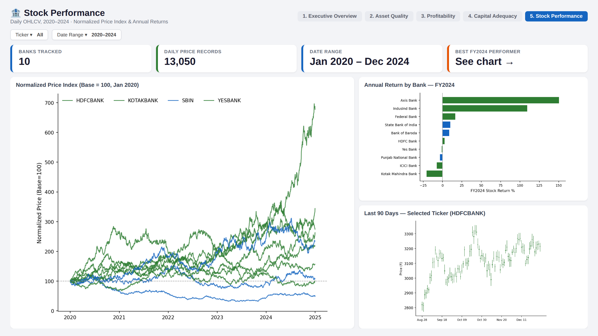

# 🏦 Indian Banking Sector Financial Analysis


> **Stack:** Python · SQL (SQLite) · Pandas · Matplotlib · Seaborn · Power BI

## 📌 Overview
Comprehensive financial analytics for 10 major Indian banks (PSU & Private) across FY2020–FY2024.
Covers database design, SQL analytics, Python visualizations, and Power BI dashboards.
---

# 📊 Power BI Dashboard

## Executive Overview


## Asset Quality


## Profitability & Efficiency


## Capital Adequacy & Stability


## Stock Performance


---
## 📁 Structure
```
project3_indian_banking/
├── data/sql/schema.sql         # DB schema with views & indexes
├── data/banking_sector.db      # Auto-generated SQLite database
├── scripts/
│   ├── 01_setup_database.py    # DB creation + 12,000+ records
│   └── 02_analysis.py          # 5 charts + SQL analytics
├── reports/                    # PNG charts + summary CSV
└── powerbi_mockup/
    └── DAX_MEASURES.md         # DAX formulas + dashboard guide
```

## 🗄️ Database
- `banks` — 10 banks master data
- `quarterly_financials` — 200 quarterly records (NPA, CAR, RoE, NIM...)
- `annual_financials` — 50 annual rows with YoY growth
- `stock_prices` — ~12,000 daily OHLCV records
- Views: `v_latest_quarter` | `v_npa_trend` | `v_profitability`

## 📊 Analyses
- NPA Trend: PSU vs Private heatmap + line chart
- Profitability: RoA/RoE/NIM dashboard
- Capital Adequacy: CRAR vs RBI minimum (11.5%)
- Peer Comparison: NIM vs RoE scatter (bubble = assets)
- Credit/Deposit Growth: YoY bar charts

## 🚀 Run
```bash
pip install pandas numpy matplotlib seaborn openpyxl
python scripts/01_setup_database.py
python scripts/02_analysis.py
```

## 🏆 Skills
SQL Schema Design · SQLite · Pandas · Matplotlib · Seaborn · Power BI · DAX · Banking Domain Knowledge · NPA Analysis · Basel III CAR
